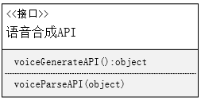

# 一、架构设计

* 小程序的设计架构为分层架构，以下为架构示意图
 
</img>

#### 1. 用户展现层

* 用户展现层是用户与小程序交互的界面，用于控制用户的数据输入输出，查看历史界面等功能。用户展现层分为登陆界面，翻译主界面和历史记录界面，登陆界面负责用户对小程序的授权，翻译主界面主要负责用户的交互，历史记录界面负责用户查看、复制的功能

#### 2. 控制层

* 控制层负责接收用户的请求，解析请求参数，调用相应的业务逻辑处理，并将处理结果返回给客户端。在小程序中，控制层用于接受并解析用户发送的请求，提取请求参数和数据，以及翻译的API封装的翻译函数的实现，用于处理用户展现层的交互和利用引擎层提供的API接口。

#### 3.引擎层

* 引擎层位于控制层之下，负责实现系统的核心业务逻辑和功能。在本小程序中即调用API接口实现翻译功能和语音合成功能，并将数据传输给控制层展现给用户。

#### 4.基础设施层

* 基础设施层主要包括通过微信开发平台提供的API函数实现对用户内存，网络，I/O设备的访问，实现获取图片，发送用户请求等更基础的功能，并为引擎层的API函数提供支持。

# 二、详细设计

#### 1. 接口设计

##### 1.用户展现层接口

##### 2. 控制层接口

1. 获取用户输入接口：
    
*  getSourceText(string)：获取用户的输入待翻译文本或图片或语音等
*  getTranslateSource(string)：获取用户的源语言
*  getTranslateDestination(string)：获取用户的待翻译语言
2. 设置接口：
    
*  setTranslateSource(void)：将输入语言设置为用户选择的输入语言
*  setTranslateDestination(void)：将翻译语言设置为用户选择的翻译语言
3. 翻译接口：
    
*  Translate()：通过引擎层接口实现翻译
*  sendTranslateResult(object)：将翻译结果发送至用户展现层
*  sendVoiceGenerateResult()：将语音合成的结果发送至用户展现层

##### 3. 引擎层接口

1. 翻译API
    
* generalTranslateAPI()：通用文本翻译API
* pictureTranslateAPI()：图片翻译API
* voiceTranslateAPI()：语音翻译API
* 通过上一层的Translate()函数调用API进行翻译，并将结果返回至Translate()
2. 语音合成API
    
* voiceGenerateAPI()：语音合成API
* voiceParseAPI(object)：将语音合成API返回的值进行解析生成语音文件返回至上一层

##### 4. 基础设施层接口

1. 微信基础设施API
   
* wx.request()：向API提供平台发送网络请求
* wx.setStorage()：向用户内存存储历史记录